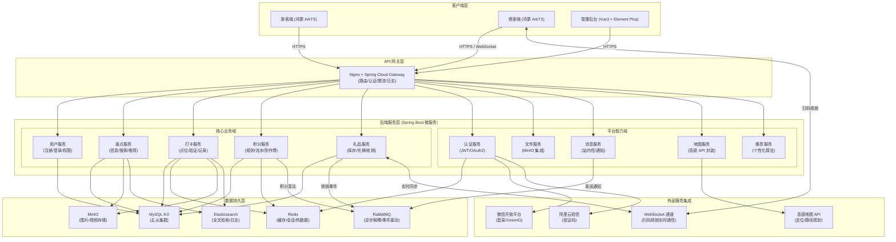

# 景区小程序项目设计文档

## 1. 战略需求与产品需求

### 1.1 战略愿景与目标

本项目的核心战略愿景是打造一个沉浸式智慧旅游新标杆，彻底改变传统景区的游览体验模式。我们致力于通过数字化创新手段，构建一个"线上+线下"深度融合的旅游体验生态系统，推动传统景区向智慧化、个性化、互动化方向实现全面转型升级。

在长期战略目标方面，我们重点关注四个维度的深度发展。首先是体验升级维度，我们要实现从传统观光游向深度体验游的根本性转变，通过数字化工具显著提升游客的满意度和重游率。其次是数据驱动维度，我们将建立完整的游客行为数据采集与分析体系，为景区的精细化运营提供强有力的数据支撑。第三是生态共建维度，我们要构建连接游客、景区管理方和商家的多方共赢旅游服务生态，实现价值的良性循环。最后是品牌塑造维度，通过卓越的数字化体验来增强景区的品牌影响力和市场竞争力，打造差异化优势。

### 1.2 产品核心价值主张

对于游客群体，我们提供全方位的价值体验。在智能导览方面，我们提供个性化的游览路线推荐服务，帮助游客高效规划行程。在互动体验层面，我们设计了社交化的打卡分享机制，让游览过程充满乐趣和互动性。通过建立积分激励体系，游客可以获得实物奖励，增强参与感和获得感。同时，我们整合了景区信息服务，为游客提供一站式的便捷服务体验。

对于景区管理方，我们提供深度的运营管理价值。通过实时采集和分析游客行为数据，为管理决策提供精准的数据洞察支持。我们构建了数字化的营销活动管理平台，让活动运营更加高效便捷。提供智能化的运营管理工具，显著提升管理效率。最重要的是，我们建立了数据驱动的运营决策支持系统，帮助管理者做出更科学的决策。

对于商家伙伴，我们提供切实的商业价值。通过精准的客源推荐和引流机制，帮助商家获得更多优质客户。利用积分消费体系促进营收增长，实现营销转化的提升。我们优化了核销流程，提供移动端快速核销体验，大大提升了操作便捷性。同时为商家提供核销数据分析报告，帮助其更好地了解经营状况。

### 1.3 产品需求详述

在功能需求的规划上，我们采用渐进式开发思路，将功能分为三个层次来推进，这样既能够保证项目按时交付，又便于团队分阶段学习和掌握相关技术。

**核心功能层（P0级别）**
这是我们项目第一阶段必须完成的基础功能，也是整个小程序的基石。游客端需要实现最核心的地图打卡功能，让用户能够在地图上看到各个景点位置并进行打卡操作；景点介绍模块要能够展示景点的基本信息、图片和文字描述；个人中心则负责管理用户的基本信息和历史记录。管理端方面，我们需要搭建基础的内容管理后台，让管理员能够方便地更新景点信息；用户管理功能用于查看和管理用户数据；简单的数据分析模块可以帮助了解用户行为。这些功能构成了产品最基础的服务能力，也是团队最先需要攻克的技术难点。

**体验增强层（P1级别）**
在基础功能稳定后，我们将着手开发提升用户粘性的功能模块。游客端会引入积分体系，用户通过打卡、互动等行为获得积分，增加使用的趣味性和持续性；附近推荐功能基于用户位置智能推荐周边的景点和商家；点评互动让用户能够分享自己的游览体验。商家端则要实现礼品核销的完整流程，包括二维码生成、扫码核销等功能，形成商业闭环。这些功能将在第二阶段开发，进一步丰富产品体验。

**价值拓展层（P2级别）**
作为产品的进阶功能，这一层次着眼于构建更完整的生态体系。智能推荐功能会根据用户行为偏好推荐个性化的游览路线；社交功能增强用户之间的互动交流；活动运营模块支持线上营销活动的创建和管理。这些功能具有较高的技术挑战性，将在团队技术能力提升后逐步实现。

在技术指标方面，我们结合学生项目的实际情况制定了切实可行的目标。性能上要求主要页面加载时间在3秒内完成，核心的打卡操作响应时间控制在2秒以内，确保用户使用流程的顺畅。系统稳定性方面，目标是在开发调试阶段能够稳定运行，在上线后保证主要功能持续可用。数据安全需要实现用户信息的加密存储，并对打卡等关键操作进行基本的防作弊检查。系统设计要预留扩展接口，便于后续功能的迭代开发。同时要确保应用能够在主流设备上正常运行，覆盖大多数用户的使用场景。

## 2. 需求表达方法：用户故事地图

### 2.1 游客旅程故事地图

我们从游客的完整旅程角度出发，构建了细致入微的用户故事地图。在游览前准备阶段，不同角色的游客有着各自的需求。作为新游客，他们希望了解景区的特色和历史背景，建立初步的认知和期待。作为行程计划者，他们需要查看景点分布和推荐路线，合理规划游览时间。作为实用主义者，他们关注住宿餐饮等配套服务的详细信息。而作为优惠寻求者，他们则希望了解门票政策和各种优惠活动。

进入游览中体验阶段，游客的需求更加具体和即时。具有导航需求的游客期望获得实时定位和精准的路线指引，确保游览过程顺畅。注重体验记录的游客希望在各个景点通过打卡功能保存珍贵记忆。喜爱社交分享的游客想要及时分享见闻并了解他人的动态。需要即时决策的游客期待获得周边的个性化推荐和提醒。而遇到问题的游客则要求能够快速联系客服获得解决方案。

游览结束后的延续阶段同样重要。作为回忆整理者，游客希望查看完整的游览记录，重温美好时光。作为奖励获取者，他们期待通过积分兑换有意义的纪念礼品。作为经验分享者，他们愿意点评景点帮助其他游客做出选择。而对于可能再次游览的游客，他们需要了解未体验景点的相关信息，为下次游览做准备。

### 2.2 管理方运营故事地图

从管理方的运营视角，我们构建了多层次的故事地图。在日常运营管理层面，不同岗位的管理人员有着明确的分工需求。内容管理员需要全面管理景区介绍和景点信息，确保信息的准确性和时效性。活动运营者负责配置打卡点和积分规则，设计吸引游客参与的互动机制。用户管理员要管理用户账号和权限，维护系统的安全稳定。客服人员则需要高效处理用户咨询和投诉，提升用户满意度。

在数据驱动决策层面，各专业角色有着不同的数据分析需求。数据分析师需要查看详细的游客行为统计数据，挖掘用户行为规律。运营经理要分析打卡热力分布和游客流向，优化景区资源配置。商业负责人需要评估积分消耗和礼品兑换情况，监控商业运营效果。战略决策者则依赖多维度运营报表来支持重大决策。

营销活动执行层面同样需要系统化的支持。营销策划人员希望便捷地设计并执行线上营销活动，快速验证活动效果。渠道管理人员需要有效管理合作商家和礼品供应商，维护良好的合作关系。效果评估人员则要精准追踪活动投资回报率和用户参与度，为后续优化提供依据。

### 2.3 商家服务故事地图

对于商家用户，我们根据其日常工作流程设计了相应的故事地图。在日常经营支持方面，不同层级的员工有着各自的工作需求。前台员工需要快速核销用户兑换的礼品，确保服务效率。店长要查看每日核销数据和统计报表，掌握经营状况。老板则需要分析礼品兑换带来的客流转化效果，评估合作价值。

在合作关系维护层面，商家有着多方面的需求。作为合作商家，他们希望了解活动参与的具体效果，优化合作策略。作为服务提供方，他们需要及时更新商家信息和促销活动，保持信息的准确性。作为生态伙伴，他们期望获得用户反馈和改进建议，持续提升服务质量。

## 3. 系统架构设计

### 3.1 整体系统架构
```
┌─────────────────┐    ┌─────────────────┐          ┌─────────────────┐
│   移动端        │    │   Web管理端      │          │   商家端        │
│  (鸿蒙ArkTS)    │    │(Vue3+TypeScript)│          │  (鸿蒙ArkTS)    │
└─────────────────┘    └─────────────────┘          └─────────────────┘
           │                        │                        │
           └───────────┬────────────┘                        │
                       │                                     │
             ┌─────────┴─────────┐                           │
             │    API网关        │                           │
             │   (Nginx)         │                           │
             └─────────┬─────────┘                           │
                       │                                     │
           ┌───────────┴───────────┐                         │
           │                       │                         │
┌───────────▼─────────┐ ┌───────────▼─────────┐              │
│   业务服务层         │ │   基础服务层         │              │
│ • 用户服务          │ │ • 文件服务           │               │
│ • 景点服务          │ │ • 消息服务           │               │
│ • 打卡服务          │ │ • 地图服务           │               │
│ • 积分服务          │ │ • 认证服务           │               │
│ • 礼品服务          │ │ • 推荐服务           │               │
│ • 数据服务          │ │                      │               │  
└───────────┬─────────┘ └───────────┬─────────┘              │
           │                       │                         │
           └───────────┬───────────┘                         │
                       │                                     │
             ┌─────────▼─────────┐                           │
             │   数据持久层       │                           │
             │ • MySQL          │                            │
             │ • Redis          │                            │
             │ • MinIO          │                            │
             │ • Elasticsearch  │                            │  
             │ • RabbitMQ       │                            │  
             └───────────────────┘                           │
                       │                                     │
             ┌─────────▼─────────┐             ┌─────────────▼─────────┐
             │   外部服务集成     │             │     扫码核销通信       │
             │ • 微信登录        │              │      (WebSocket)      │
             │ • 短信验证        │              └───────────────────────┘
             │ • 地图API         │
             │ • 位置服务        │
             │ • 支付接口        │                            
             │ • 客服系统        │                            
             └───────────────────┘
```


#### 技术栈概览

**前端展现层**

- **移动端**：鸿蒙ArkTS + ArkUI声明式开发
- **Web管理端**：Vue 3 + Element Plus
- **商家端**：鸿蒙ArkTS轻量应用

**后端服务层**

- **应用框架**：Java + Spring Boot
- **数据缓存**：Redis哨兵模式
- **消息队列**：RabbitMQ异步处理
- **文件存储**：MinIO对象存储

**数据持久层**

- **主数据库**：MySQL 8.0主从集群
- **搜索引擎**：Elasticsearch全文检索
- **实时数据**：Redis缓存数据库

**外部服务集成**

- **地图服务**：高德地图API
- **登录服务**：微信开放平台
- **短信服务**：阿里云短信API

整个系统采用分层架构设计，确保各层之间的清晰界限和良好协作。在最上层的前端展现层，我们设计了三个独立的客户端应用。移动端应用采用鸿蒙ArkTS技术栈开发，为游客提供原生的移动体验。Web管理端使用Vue3配合Element Plus组件库，为管理人员提供功能丰富的后台管理界面。商家端应用同样基于鸿蒙ArkTS开发，专注于核销等核心业务功能。

API网关层作为系统的统一入口，承担着重要的协调作用。这一层负责请求的负载均衡，确保系统在高并发情况下的稳定运行。同时处理路由分发，将请求准确导向对应的后端服务。还实现了限流保护机制，防止系统因突发流量而崩溃。

业务服务层采用微服务架构，将系统功能拆分为多个独立的服务单元。用户服务负责处理所有用户相关的业务逻辑，包括注册登录和个人信息管理。景点服务管理景区的基础数据，提供地理位置相关功能。打卡服务处理核心的打卡业务，包括位置验证和记录管理。积分服务管理复杂的积分规则和流水记录。礼品服务则负责礼品库存和兑换核销等业务流程。

基础服务层为上层业务提供通用的技术支撑。文件服务统一管理图片、视频等文件资源。消息服务处理系统内的各种消息通知。地图服务集成第三方地图能力，提供位置相关功能。推荐服务实现个性化的智能推荐算法。认证服务则确保系统访问的安全性。

数据持久层采用多元化的存储方案，满足不同的数据存储需求。关系数据库MySQL存储核心业务数据，保证数据的完整性和一致性。缓存层Redis提升系统性能，处理高频访问数据。文件存储MinIO专门管理大型文件资源。搜索引擎Elasticsearch提供强大的数据检索能力。消息队列RabbitMQ确保系统间的可靠通信。

最底层的外部服务集成层连接各类第三方服务。微信登录提供便捷的身份认证方式。短信验证确保关键操作的安全性。地图API增强位置服务能力。支付接口支持在线交易功能。客服系统提升用户服务体验。

### 3.2 移动端架构（鸿蒙ArkTS）

移动端应用采用清晰的四层架构设计，确保代码的良好组织和可维护性。

表现层是用户直接交互的界面部分，由三个层次的组件构成。页面组件负责整个页面的布局和业务逻辑协调，是功能的直接载体。业务组件封装了特定的功能模块，可以在不同页面间复用。基础组件提供最基础的UI元素，构建用户界面的基石。

逻辑层处理应用的业务逻辑和数据流。状态管理维护应用的数据状态，确保界面与数据的同步。业务逻辑层包含具体的功能实现算法和流程控制。路由管理负责页面间的导航和跳转逻辑。

服务层提供基础的技术能力支持。网络服务封装所有HTTP请求，处理与后端的数据交换。存储服务管理本地数据的持久化存储。位置服务提供设备定位能力，支持基于位置的功能。地图服务集成地图显示和交互功能。

基础层包含项目的支撑要素。工具类提供通用的功能方法，简化开发复杂度。常量定义集中管理系统中的所有固定值。类型定义规范数据结构，确保类型安全。

在功能模块划分方面，我们设计了五个核心模块。地图导览模块提供景区导航功能，包括手绘地图展示、实时位置定位、景点信息弹窗和导航路线规划。打卡互动模块涵盖社交功能，支持位置验证打卡、拍照上传、点赞评论互动和打卡记录浏览。发现推荐模块提供个性化内容，包括附近推荐瀑布流、热门排序筛选、商家服务列表和实时动态展示。个人中心模块管理用户信息，包含个人信息管理、打卡成就展示、积分礼品兑换和个人排名查看。系统设置模块处理应用配置，包括账号安全设置、通知权限管理和客服帮助中心。

### 3.3 Web管理端架构

Web管理端为景区管理人员提供全面的后台管理功能，涵盖六个主要功能领域。

数据看板模块提供运营概览，包括实时数据监控、关键指标展示、趋势分析图表和预警提示信息，帮助管理人员快速掌握整体运营状况。

内容管理模块负责景区信息的维护，支持景区介绍管理、景点信息维护、商家信息管理和图文内容编辑，确保前端展示内容的准确性和时效性。

用户运营模块关注用户生命周期管理，提供用户信息管理、行为数据分析、积分规则配置和活动运营管理功能，助力用户活跃度和忠诚度的提升。

打卡管理模块处理核心业务数据，包括打卡点位管理、打卡记录审核、热力分布分析和数据统计分析，为运营决策提供数据支持。

礼品管理模块管理积分兑换体系，涵盖礼品库存管理、供应商管理、兑换记录查询和核销数据统计，确保积分生态的健康运行。

系统管理模块保障平台稳定，提供角色权限管理、操作日志审计、系统配置管理和数据备份恢复功能，维护系统的安全性和可靠性。

### 3.4 后端服务架构

后端采用微服务架构，将系统功能拆分为多个独立的服务单元，每个服务专注于特定的业务领域。

网关服务作为系统的统一入口，承担着重要的协调职能。它负责请求的路由分发，确保请求能够准确到达目标服务。同时处理身份认证和权限验证，保障系统安全。还实现流量控制和限流保护，维护系统稳定性。完整的日志记录和追踪功能为问题排查提供支持。

用户服务管理所有用户相关业务，处理用户注册登录流程，管理个人信息维护，控制权限角色分配，维护用户关系网络。

景点服务负责景区基础数据，管理景点信息维护，提供地理位置服务，实现推荐算法逻辑，支持搜索查询功能。

打卡服务处理核心打卡业务，管理打卡点位配置，提供位置验证服务，维护打卡记录数据，支持互动点赞功能。

积分服务管理积分生态系统，配置积分规则策略，记录积分流水明细，计算积分排名数据，实施防作弊验证机制。

礼品服务处理礼品兑换流程，管理礼品库存状态，处理兑换订单业务，提供核销验证服务，维护供应商信息。

数据服务提供分析决策支持，进行数据统计分析，生成报表文档，推送实时数据更新，实现数据可视化展示。

### 3.5 AI与大数据架构

智能推荐系统构建了完整的推荐生态，从数据采集到服务应用形成闭环。数据采集层负责多维度数据收集，包括用户行为数据、地理位置数据和环境上下文信息。特征工程层进行深度数据处理，构建用户画像体系，提取物品特征维度，处理上下文信息，计算实时特征指标。算法模型层集成多种推荐算法，包括协同过滤推荐、基于内容推荐、混合推荐模型和实时推荐引擎。服务应用层将推荐能力转化为实际功能，提供个性化景点推荐、智能路线规划、商家精准推荐和活动智能推送服务。

数据分析平台建立了完整的数据处理流水线。数据源层整合多元数据，包括业务数据库、日志文件、用户行为数据和外部数据源。数据计算层提供多种处理能力，支持实时流处理、批量数据处理、数据清洗转换和指标计算聚合。数据存储层采用分层存储策略，构建数据仓库体系，配置实时数据库，部署分析数据库，利用缓存数据库。数据应用层提供多样化的数据服务，包括多维分析报表、数据可视化展示、预测预警功能和决策支持系统。



